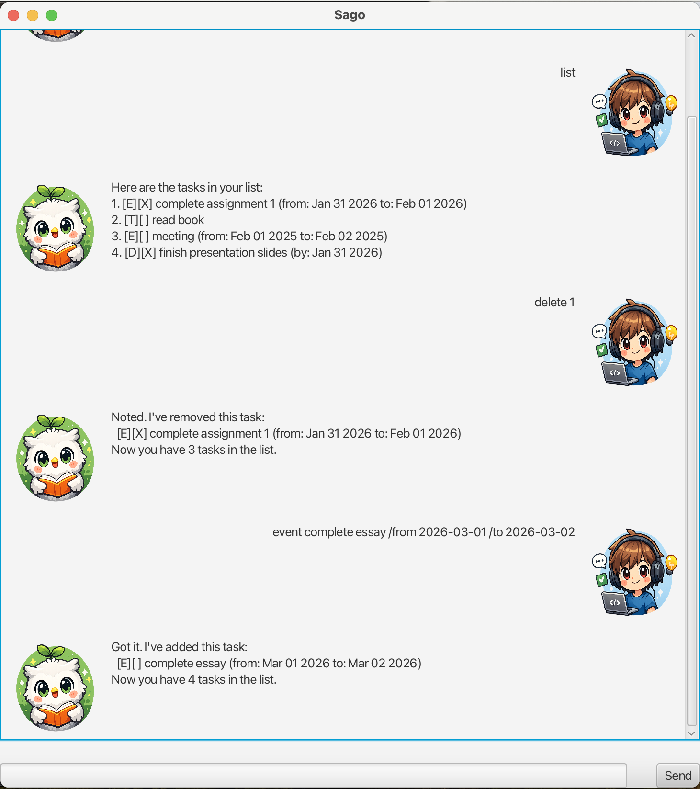

# Sago

Sago is a desktop task manager chatbot built with Java and JavaFX.
It is designed for fast keyboard-based task management with a simple GUI.



## Overview

Sago helps users keep track of tasks such as todos, deadlines, and events.
It supports common task operations such as adding, listing, marking,
unmarking, deleting, and finding tasks.

## Links

- [User Guide](docs/README.md)
- [Source Code](src/main/java)

## Quick Start

1. Ensure you have Java 17 installed.
2. Download the latest `sago.jar` file from the GitHub Releases page.
3. Open a terminal in the folder containing `sago.jar`.
4. Run:

```bash
java -jar sago.jar
```

## Features

- Add todos, deadlines, and events
- Mark and unmark tasks
- Delete tasks
- Find tasks by keyword
- View help and exit with `bye`
- Use the app through a JavaFX chat-style interface

For full command details and examples, see the [User Guide](docs/README.md).
